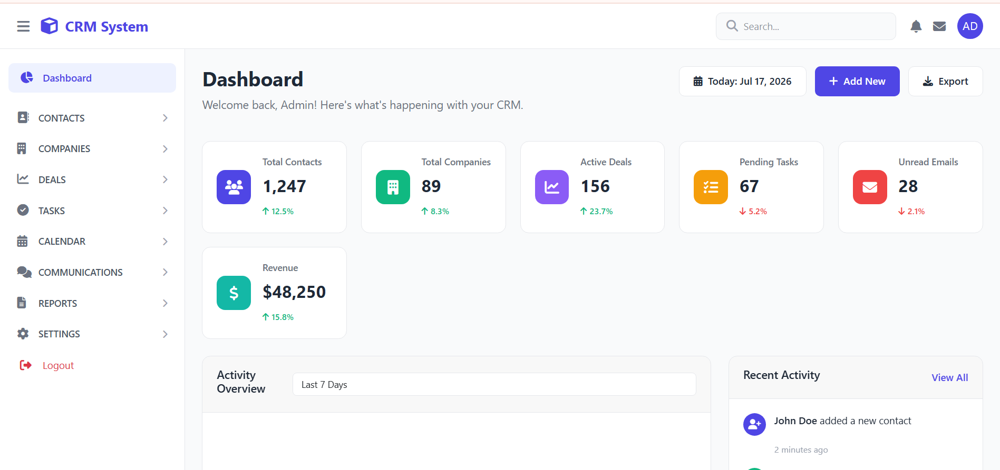

# CRM System

A modern, responsive, and scalable Customer Relationship Management (CRM) system built with **Laravel 12**, **Livewire 3**, **Bootstrap 5**, and **JavaScript**. This application helps businesses manage customers, companies, deals, tasks, communications, and business activities from a single dashboard.

---

## 🚀 Features

### 📊 Dashboard
- Business Overview
- Statistics Cards
- Revenue Summary
- Recent Activities
- Activity Overview
- Quick Actions

### 👥 Contact Management
- Add Contacts
- Edit Contacts
- Delete Contacts
- Contact Groups
- Import Contacts (CSV)
- Search & Filter
- Contact Profile

### 🏢 Company Management
- Manage Companies
- Company Profiles
- Company Contacts
- Company Deals

### 💼 Deal Management
- Sales Pipeline
- Active Deals
- Won Deals
- Lost Deals
- Deal Tracking
- Follow Ups

### ✅ Task Management
- My Tasks
- All Tasks
- Create Tasks
- Completed Tasks
- Due Dates
- Task Priority

### 📅 Calendar
- Events
- Meetings
- Schedule
- Reminders

### 📧 Communications
- Emails
- Calls
- Meetings
- Activity Log

### 📈 Reports
- Sales Report
- Activity Report
- Performance Report

### ⚙️ Settings
- General Settings
- User Management
- Roles & Permissions

---

# ✨ Built With

- Laravel 12
- Livewire 3
- Bootstrap 5
- JavaScript (ES6)
- MySQL
- Font Awesome
- Vite
- Composer

---

# 📁 Project Structure

```
app/
│
├── Livewire/
│   └── Pages/
│       └── Admin/
│           ├── Dashboard
│           ├── Contacts
│           ├── Companies
│           ├── Deals
│           ├── Tasks
│           ├── Calendar
│           ├── Communications
│           ├── Reports
│           └── Settings
│
resources/
│
├── views/
│   └── livewire/
│
routes/
└── web.php
```

---

# 🖥️ Screenshots

## Dashboard



## Contacts


## Companies


## Deals


## Tasks


---

# ⚙️ Installation

## Clone Repository

```bash
git clone https://github.com/yourusername/crm-system.git
```

Move to Project

```bash
cd crm-system
```

Install PHP Dependencies

```bash
composer install
```

Install Node Packages

```bash
npm install
```

Create Environment File

```bash
cp .env.example .env
```

Generate Application Key

```bash
php artisan key:generate
```

Configure Database

```
DB_CONNECTION=mysql
DB_HOST=127.0.0.1
DB_PORT=3306
DB_DATABASE=crm_system
DB_USERNAME=root
DB_PASSWORD=
```

Run Migrations

```bash
php artisan migrate
```

Run Seeder (Optional)

```bash
php artisan db:seed
```

Start Development Server

```bash
php artisan serve
```

Compile Assets

```bash
npm run dev
```

---

# 📦 Modules

- Dashboard
- Contacts
- Companies
- Deals
- Tasks
- Calendar
- Communications
- Reports
- Settings

---

# 🎨 UI Features

- Responsive Design
- Bootstrap 5
- Modern Dashboard
- Sidebar Navigation
- Sticky Header
- Font Awesome Icons
- Clean User Interface
- Mobile Friendly

---

# 🔒 Authentication

- Login
- Logout
- Forgot Password
- Password Reset

---

# 👨‍💼 User Roles

- Super Admin
- Admin
- Sales Manager
- Sales Executive
- Staff

---

# 📈 Upcoming Features

- Lead Management
- Email Integration
- WhatsApp Integration
- Notifications
- File Manager
- Customer Portal
- Invoice Management
- API Support
- AI Assistant
- Audit Logs
- Multi-language Support

---

# 🤝 Contributing

Contributions are welcome.

1. Fork the repository

2. Create your branch

```bash
git checkout -b feature/new-feature
```

3. Commit changes

```bash
git commit -m "Added new feature"
```

4. Push changes

```bash
git push origin feature/new-feature
```

5. Create a Pull Request

---

# 🐞 Report Issues

If you find any bugs, please open an issue and include:

- Description
- Steps to Reproduce
- Expected Result
- Screenshots (Optional)

---

# 📄 License

This project is licensed under the MIT License.

---

# 👨‍💻 Author

**Muhammad Asad Mukhtar**

Full Stack Web Developer

### Tech Stack

- Laravel
- Livewire
- PHP
- JavaScript
- Bootstrap 5
- MySQL

---

## ⭐ Support

If you found this project helpful, please give it a ⭐ on GitHub.

---

## 🚧 Project Status

**Active Development**

This CRM System is currently under active development. New modules and enhancements are continuously being added to make it a complete, enterprise-ready CRM solution.